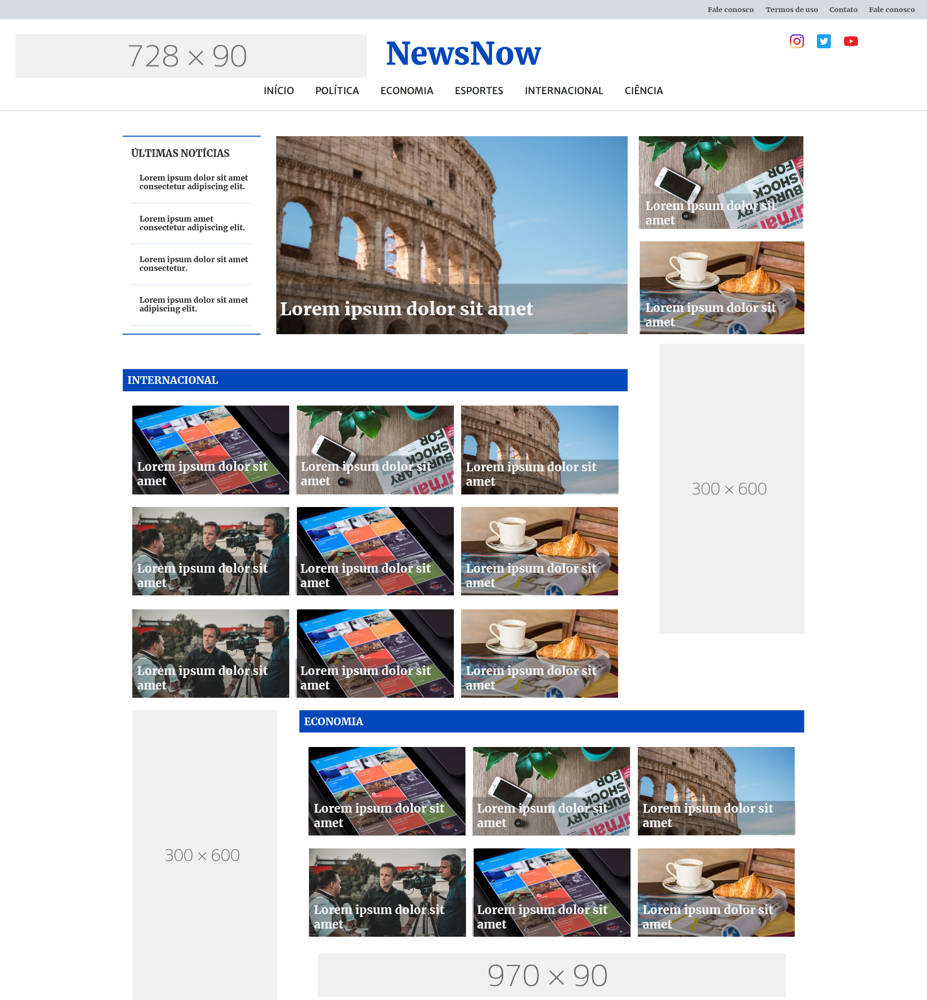

# Front-end project
Criei este projeto com o objetivo de treinar e demonstrar minhas habilidades no desenvolvimento de sites na parte front-end. Para tanto, criei um cliente fictício e fiz os requisitos que esse suposto cliente solicitou.

## O texto abaixo simula um cliente enviando a um desenvolvedor os detalhes técnicos para o seu site assim como o desenvolvedor fazendo o "orçamento" para a produção do site.

**Ideia principal: página inicial de um site de notícias para a empresa NewsNow.**

### Você pode olhar o site através deste link: https://srbrunoferreira.github.io/front-end-de-um-site-de-noticias/

### Exigências:
1.	O design precisa passar um sentimento de seriedade e profissionalismo.
2.	A página inicial precisa contemplar a notícia principal do dia, e as demais notícias precisam aparecer, em escalar menor, logo abaixo da manchete.
3.	A logo da empresa deve estar centralizada no topo da página.
4.	O site deve ser responsivo até a resolução full hd.

### Tecnologias utlizadas:
1.	HTML5
2.	CSS3
3.	JavaScript ES20
4.	Visual Studio Code

### Testes:
1.	Testado nos seguintes navegadores: Chrome, Firefox, Opera e Edge, todos nas últimas versões do dia.
2.	Testado e otimizado seguindo a ferramenta Lighthouse do navegador Google Chrome.

### Das fontes utilizadas:
As fontes utilizas estão hospedadas no site do Google Fonts.
1.	Merriweather
2.	Merriweather Sans

### Das imagens utilizadas:
1.	Imagens da prototipagem retiradas do Pexels.
2.	A logo foi produzida no GIMP.

### Outras informações:
1. Programa de prototipagem usado: Justmind.

### Habilidades necessárias:
1. CSS grid layout.
2. Tags HTML voltadas para o SEO do site.
3. Web design.
5. Utlização de fontes e imagens com licença grátis (Google Fonts e Pexels).

## Protótipos do design para dispositivos mobile e desktop:

<table>
  <tr>
    <td></td>
    <td width="75%"></td>
  </tr>
</table>
